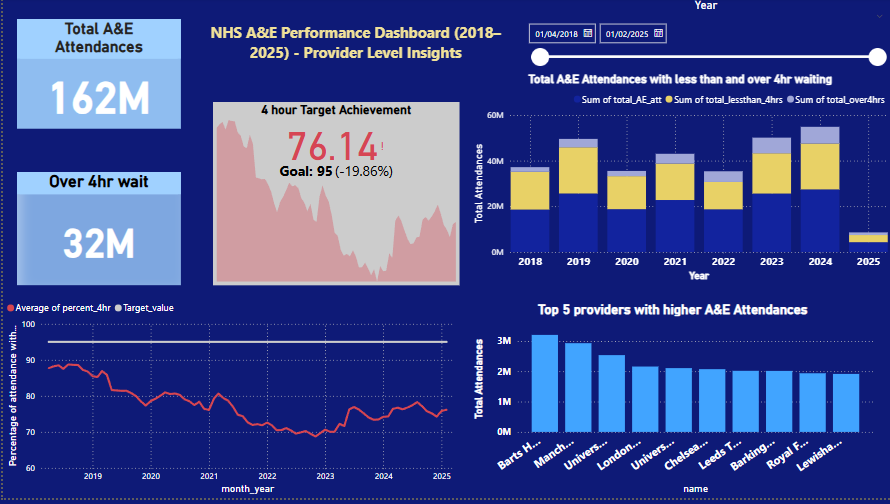

# Healthcare-Data-Analytics-Exploring-NHS-A-E-trends-with-SQL-queries-and-Power-BI-visualization.
## Objective:<b>
This project aims to analyze NHS A&E (Accident and Emergency) data from 2018 to 2025 to identify the trends in the A&E admission, examining the underperforming hospitals fail to meet the taget 4 hour wait time and to understand the increasing demmand of emrgency serivices through key techniques of data analysis.\

### Dataset <b>
The data used in this project was sourced from the official NHS England statistics on A&E waiting times and activity. This dataset provides monthly and weekly figures, including details such as total attendances, waiting times under and over 4 hours, emergency admissions, Number of patients spending greater than 4hour or 12 hour from from descision to admission.\
📎[NHS A&e Monthly Dataset](https://www.england.nhs.uk/statistics/statistical-work-areas/ae-waiting-times-and-activity/)

## Tools:<b>
•	Python– To organize the collected data and connect it to SQL.<b>
•	 SQL (MySQL) – For querying, cleaning, and aggregating hospital-level data. <b>
•	Power BI – For building dynamic visualizations, KPIs, and dashboards.<b>
•	Excel – For initial formatting and structural adjustments.<b>
•	 GitHub – To share and track progress. <b>

## Data Preparation and SQL Analysis\
### Step 1: Data Cleaning\
•	Removed footnotes, merged cells, and empty rows, and null values\
•	Standardized column names and date formats\
•	Converted percentage values from string to decimal\
•	Resolved data type mismatches (e.g., double → int/float)\

### Step 2: Complex Queries: For extracting the insights from the data\
? Top 10 providers with highest total attendances over time \
? Identify the worst month where >12 hr wait has highest per hospital\
? Which hospital consistently failed to meet the 95% 4 hr target?\

📈 These queries helped extract actionable insights from a large and complex dataset.\

## Integration with Power BI\
To effectively communicate the insights derived from SQL, the query outputs were directly integrated with Power BI. This allowed for:\
•	Real-time visualizations based on SQL data\
•	Interactive dashboards with filters and slicers\
•	Seamless updates and consistent data flow between SQL and Power BI\
The combination of SQL and Power BI made it possible to both understand and present the story behind the numbers in a compelling and intuitive format.\

To bring the numbers to life, I designed an interactive dashboard featuring:
### Key Visuals:
•	KPI Card showing % of patients seen within 4 hours\
•	Line Chart for trend analysis of percentage of attendance within 4 hours  over time\
•	 Stacked Column Charts comparing:\
         * Total attendances\
         * Patients seen in under vs. over 4 hours\
•	Bar Chart of Top 5 hospitals with the most A&E visits\
•	Slicers for filtering by month and provider\

### Power BI Dashboard

## Insights & Observations
   • The 4-hour target has been consistently missed by many providers since 2019.\
   • There is a steady increase in the number of patients waiting more than 4 and 12 hours, particularly noticeable during 2019–2020.\
    The performance dips correlate closely with COVID-19 peaks and peak demand periods.\
   • At the national level, the 95% standard has not been met on an annual basis since 2018, although it has been achieved in certain individual months by certain providers.\
   • Although the number of patients facing long waits has recently decreased, the overall average still remains below the 95% target, highlighting continued challenges in consistently \
     meeting the standard.\
   • There has been an increase in A&E attendance, reflecting growing demand on emergency services. 

